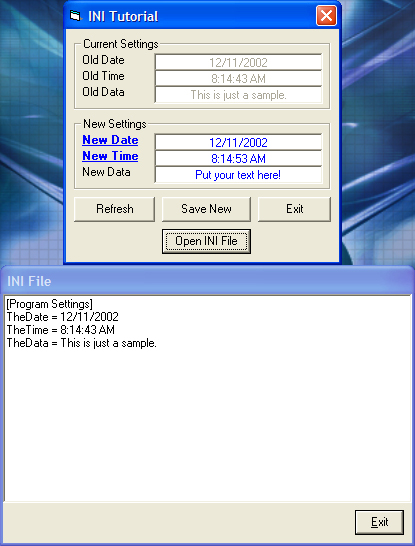

<div align="center">

## A Beginner's INI Tutorial


</div>

### Description

This is a simple project showing how to work with an INI file. It checks for the existence of the file, creates the file if needed, reads the settings and displays them. It allows writing new settings, refreshing the display on the fly. Please, comment on this if you find it useful, and as with all my submissions, I am not out for votes.
 
### More Info
 


<span>             |<span>
---                |---
**Submitted On**   |2002-12-11 08:19:02
**By**             |[VBScript](https://github.com/Planet-Source-Code/PSCIndex/blob/master/ByAuthor/vbscript.md)
**Level**          |Beginner
**User Rating**    |4.9 (142 globes from 29 users)
**Compatibility**  |VB 6\.0
**Category**       |[Coding Standards](https://github.com/Planet-Source-Code/PSCIndex/blob/master/ByCategory/coding-standards__1-43.md)
**World**          |[Visual Basic](https://github.com/Planet-Source-Code/PSCIndex/blob/master/ByWorld/visual-basic.md)
**Archive File**   |[A\_Beginner15115812112002\.zip](https://github.com/Planet-Source-Code/vbscript-a-beginner-s-ini-tutorial__1-41499/archive/master.zip)

### API Declarations

```
'--------------------------------------------------------------------------
' This module makes writing to an INI file very easy. See the examples
' below for what needs to go into the VB code for this to work.
' Write Example:
' --------------
' WriteINI "Section", "Setting", Value, App.Path & "\settings.ini"
'
' Read Example:
' -------------
' Variable = ReadINI("Section", "Setting", App.Path & "\settings.ini")
'--------------------------------------------------------------------------
Option Explicit
Public Declare Function getprivateprofilestring Lib "kernel32" Alias "GetPrivateProfileStringA" (ByVal lpApplicationname As String, ByVal lpKeyname As Any, ByVal lpdefault As String, ByVal lpreturnedstring As String, ByVal nSize As Long, ByVal lpFileName As String) As Long
Public Declare Function writeprivateprofilestring Lib "kernel32" Alias "WritePrivateProfileStringA" (ByVal lpApplicationname As String, ByVal lpKeyname As Any, ByVal lpString As Any, ByVal lpFileName As String) As Long
Function ReadINI(Section As String, KeyName As String, FileName As String) As String
  Dim sRet As String
  sRet = String(255, Chr(0))
  ReadINI = Left(sRet, getprivateprofilestring(Section, ByVal KeyName$, "", sRet, Len(sRet), FileName))
End Function
Function WriteINI(sSection As String, sKeyName As String, sNewString As String, sFileName) As Integer
  Dim r
  r = writeprivateprofilestring(sSection, sKeyName, sNewString, sFileName)
End Function
```


